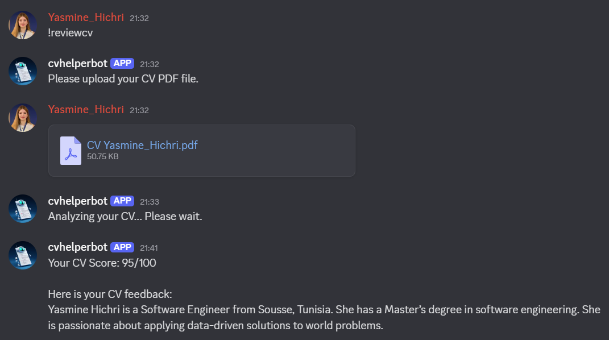

# CV Helper Bot

CV Helper Bot is a powerful and modular Discord bot designed to assist HR professionals and job seekers with CV (resume) analysis and management. The bot leverages AI and NLP to provide automated feedback, extract key information, and compare CVs directly within your Discord server.

## Features

- **CV Review & Scoring:** Analyze and score CVs based on structure, content, and grammar.
- **AI-Powered Feedback:** Summarize and provide actionable feedback using advanced language models.
- **Contact Info Extraction:** Automatically extract email, phone, and LinkedIn from uploaded CVs.
- **CV Comparison:** Compare two CVs to highlight differences, strengths, and unique skills.
- **Grammar Checking:** Detect and penalize grammar and spelling mistakes.
- **User-Friendly Commands:** Simple commands for HR and job seekers, including custom help.

## Commands

- `!reviewcv` — Analyze and summarize a CV, provide feedback, and score it.
- `!extractinfo` — Extract contact information (email, phone, LinkedIn) from a CV.
- `!cvcompare` — Compare two CVs (PDFs) and highlight differences or strengths.
- `!cvhelp` — List all available commands and what they do.

## Tech Stack

- Python 3
- discord.py
- pdfplumber
- transformers (HuggingFace)
- language-tool-python

## Getting Started

1. Clone the repository.
2. Install dependencies: `pip install -r requirements.txt`
3. Add your Discord bot token to `config.py`.
4. Run the bot: `python bot.py`
5. Invite the bot to your Discord server and start using the commands!

---

Empower your HR workflow and job search with AI-driven CV analysis—right in Discord!
